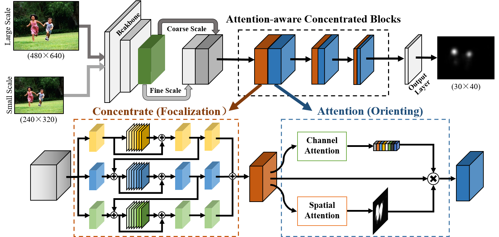
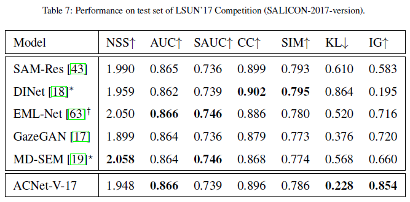
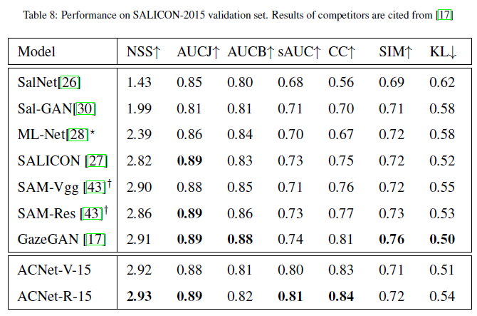
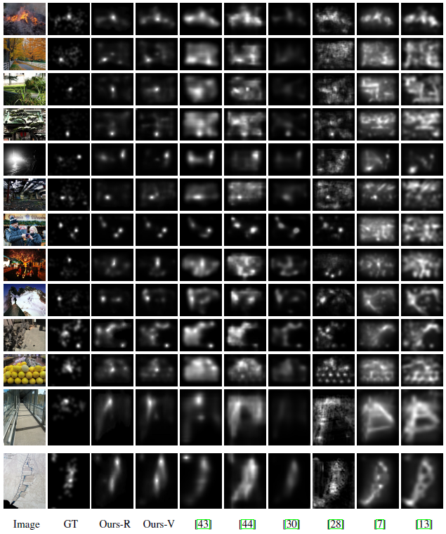

## [Attention-aware Concentrated Network for Saliency Prediction](https://doi.org/10.1016/j.neucom.2020.10.083)

by Pengqian Li, Xiaofen Xing, Xiangmin Xu, Bolun Cai, Jun Cheng

------

### Paper Details

#### Abstract

> This paper presents a biologically-inspired saliency prediction method to imitate two main characteristics of the human perception process: focalization and orienting. The proposed network, named ACNet is composed of two modules. The first one is an essential concentrated module (CM), which assists the network to “see” images with appropriate receptive fields by perceiving rich multi-scale multi-receptive-field con-texts of high-level features. The second is a parallel attention module (PAM), which explicitly guides the network to learn “what” and “where” is salient by simultaneously capturing global and local information with channel-wise and spatial attention mechanisms. These two modules compose the core component of the proposed method,named ACBlock, which is cascaded to progressively refine the inference of saliency estimation in a manner similar to that humans zoom in their lens to focus on the saliency. Experimental results on seven public datasets demonstrate that the proposed ACNet outperforms the state-of-the-art models without any prior knowledge or postprocessing.

#### Architecture



#### Comparison

- Quantitative comparisons (only part of tables are shown, for more details, please read the paper)

  

  

- Qualitative comparisons 

  

## Saliency maps & Trained model

- saliency maps: [Baidu](todo)
- trained model: [Baidu](todo)

## Citation

- If you find this work is helpful, please cite our paper
```
@article{ACNet,
    title = "Attention-aware Concentrated Network for Saliency Prediction",
    journal = "Neurocomputing",
    year = "2020",
    issn = "0925-2312",
    doi = "https://doi.org/10.1016/j.neucom.2020.10.083",
    url = "http://www.sciencedirect.com/science/article/pii/S0925231220316969",
    author = "Pengqian Li and Xiaofen Xing and Xiangmin Xu and Bolun Cai and Jun Cheng",
}
```